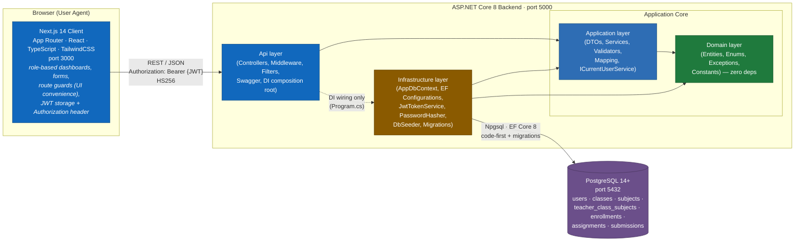
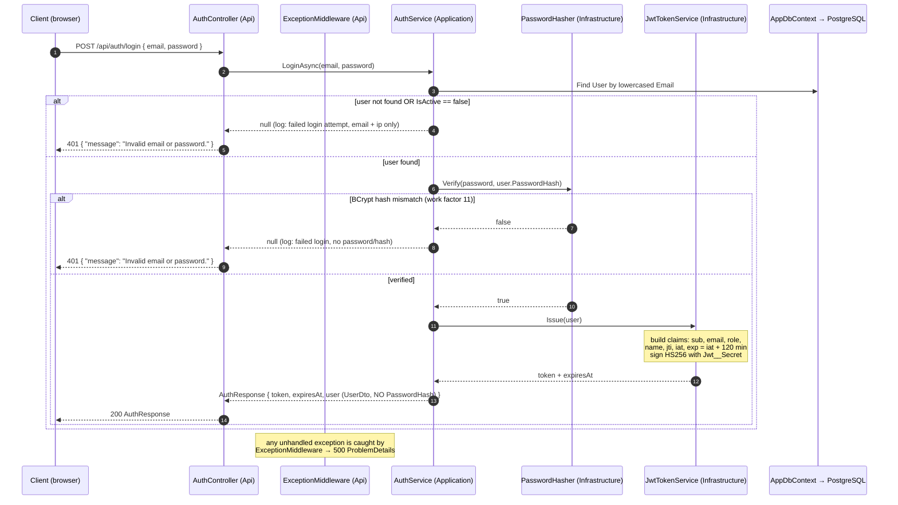
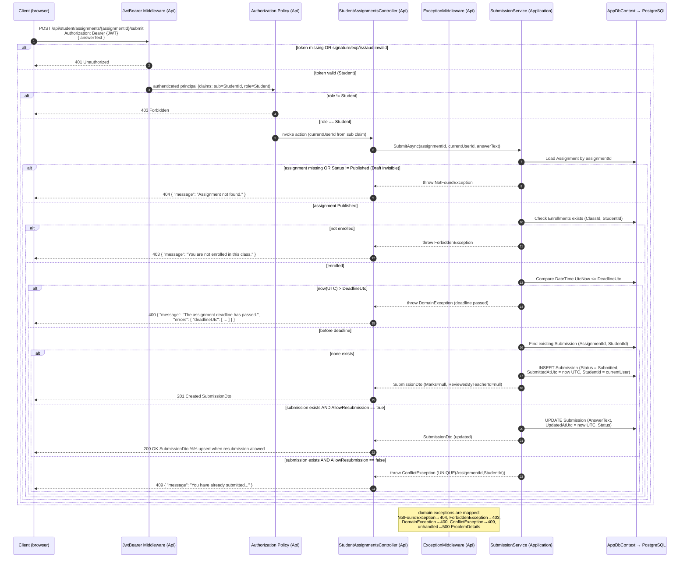
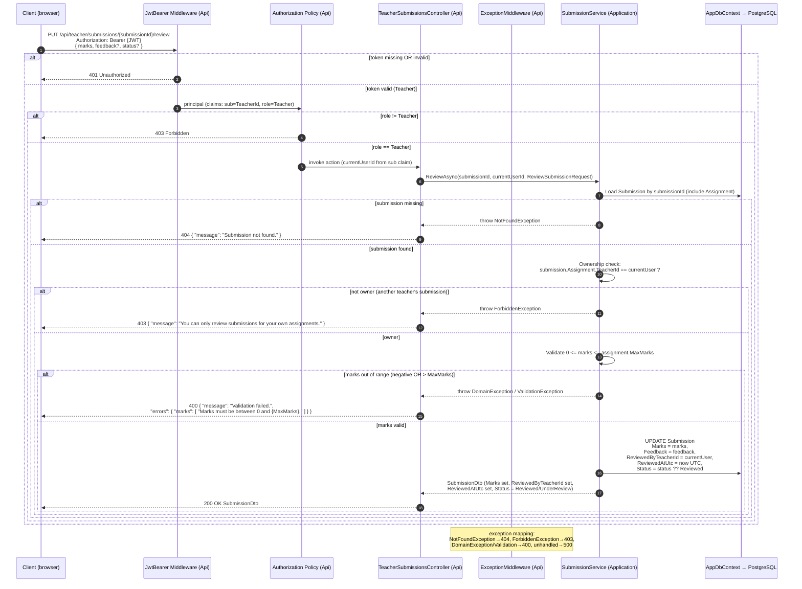

# Architecture — Assignment & Submission Management System

> **Phase 0 documentation.** This document is the single, self-contained description of how the
> system is structured and behaves end-to-end. A new engineer should be able to understand the
> whole system's design from this file alone.
>
> **Source of truth:** `docs/PRD.md` (read-only). This file stays consistent with the companion
> Phase 0 docs and **does not contradict** them:
> - [`PRD.md`](./PRD.md) — authoritative requirements.
> - [`DATABASE_SCHEMA.md`](./DATABASE_SCHEMA.md) — persistence model (cross-linked in §8).
> - [`API_CONTRACT.md`](./API_CONTRACT.md) — HTTP endpoints & DTOs (names used verbatim).
> - [`AUTH_MODEL.md`](./AUTH_MODEL.md) — authentication & authorization detail (cross-linked in §7).
> - [`PROJECT_STRUCTURE.md`](./PROJECT_STRUCTURE.md) — repository scaffold blueprint (§3, §4, §9).
> - [`BUSINESS_RULES.md`](./BUSINESS_RULES.md) — rule-to-test mapping.
>
> **Canonical contract in force:** Backend **ASP.NET Core 8 + C#**, **EF Core 8 + Npgsql**,
> **PostgreSQL 14+**, **BCrypt.Net-Next**, **JwtBearer HS256**, **FluentValidation**, **xUnit**.
> Frontend **Next.js 14 App Router + React + TypeScript + TailwindCSS**. Layers:
> `Api → Application → Domain`; `Infrastructure → Application/Domain`. Ports: API `5000`, client `3000`.

---

## Table of Contents

1. [Overview & Goals](#1-overview--goals)
2. [System Context (C4 Level 1)](#2-system-context-c4-level-1)
3. [Container / Component View](#3-container--component-view)
4. [Layered Architecture](#4-layered-architecture)
5. [Request Flow](#5-request-flow)
6. [Cross-Cutting Concerns](#6-cross-cutting-concerns)
7. [Security Architecture](#7-security-architecture)
8. [Data Architecture](#8-data-architecture)
9. [Technology Stack](#9-technology-stack)
10. [Non-Functional Considerations](#10-non-functional-considerations)
11. [Open Questions & Risks](#11-open-questions--risks)

---

## 1. Overview & Goals

The **Assignment & Submission Management System** is a role-based full-stack web application for a
school or college that lets **Teachers** create assignments for specific classes/courses and
subjects, **Students** view and submit answers to those assignments, and **Teachers** review
submissions and assign marks and feedback. There are exactly three roles, modeled by the
`UserRole` enum: **`Admin`** (manages users, classes, subjects, teacher assignments, and
enrollments, and has read-only visibility over all assignments and submissions), **`Teacher`**
(creates/publishes/edits/deletes their own assignments and reviews submissions for their own
assignments), and **`Student`** (views only `Published` assignments for classes they are enrolled
in, submits/updates answers before the deadline, and views their own status, marks, and feedback).
At a high level the system is a **two-app monorepo** with a single-page **Next.js 14 client** in the
browser that talks over a **REST API (JSON/JWT)** to a **layered ASP.NET Core 8 backend**, which
enforces all authentication and business rules server-side and persists everything to a single
**PostgreSQL** database via **EF Core 8 (code-first)**. Role-based access, ownership checks,
deadline (UTC) enforcement, and one-submission-per-`(assignment, student)` uniqueness are all
authoritative on the backend — the frontend UI is a convenience layer, never the security boundary.

---

## 2. System Context (C4 Level 1)

The system sits between three human actors and a single relational database. There is no outbound
email/SMS integration in scope (see §10, PRD §17).

```mermaid
C4Context
    title Assignment & Submission Management System — System Context (C4 L1)

    Person(admin, "Admin", "Manages users, classes, subjects, teacher\nassignments & enrollments; views all assignments\nand submissions (read-only).")
    Person(teacher, "Teacher", "Creates/publishes/edits assignments for\nassigned (class, subject); reviews submissions\nand assigns marks & feedback.")
    Person(student, "Student", "Views Published assignments for enrolled\nclasses; submits/updates answers before the\ndeadline; views own status, marks & feedback.")

    System_Boundary(sys, "Assignment & Submission Management System") {
        System(ams, "Assignment Management System", "ASP.NET Core 8 REST API + Next.js 14 client.\nJWT (HS256) auth, role-based authorization,\nEF Core 8 persistence.")
    }

    System_Ext(pg, "PostgreSQL 14+", "Relational database. Holds users, classes,\nsubjects, teacher assignments, enrollments,\nassignments, and submissions.")

    Rel(admin, ams, "Uses (browser, HTTPS, JWT)")
    Rel(teacher, ams, "Uses (browser, HTTPS, JWT)")
    Rel(student, ams, "Uses (browser, HTTPS, JWT)")

    Rel(ams, pg, "Reads / writes (Npgsql, EF Core 8, TCP 5432)")

    UpdateRelStyle(admin, ams, $offsetX=-40, $offsetY=-20)
    UpdateRelStyle(teacher, ams, $offsetX=0, $offsetY=-30)
    UpdateRelStyle(student, ams, $offsetX=40, $offsetY=-20)
```

**Context notes:**

- All three actors reach the system only through a web browser over HTTPS (HTTP in local
  Development). Authentication is **JWT Bearer**, issued at `POST /api/auth/login`.
- **SMTP/email and SMS are out of scope** (PRD §17) — there is no email verification, password reset,
  or notification delivery. They are intentionally not drawn as external systems.
- The only external dependency is **PostgreSQL** (`5432`). There are no third-party SaaS integrations.

---

## 3. Container / Component View

The monorepo contains two independently buildable applications plus the shared database. The
backend is internally split into four layers (Api / Application / Domain / Infrastructure).



**Container responsibilities:**

| Container | Responsibility | Tech |
|---|---|---|
| **Next.js Client** (browser, `3000`) | UI for all three roles: login page, role dashboards, validated forms, loading/error/empty states, client-side route protection (defense in depth — **not** the authority), attaches `Authorization: Bearer {token}` to every API call. | Next.js 14 App Router, React, TypeScript, TailwindCSS |
| **ASP.NET Core API** (`5000`) | The single security & business-rule authority. Hosts controllers, JWT middleware, global exception handling, validation, Swagger, and the DI composition root (`Program.cs`). | ASP.NET Core 8, C# |
| **PostgreSQL** (`5432`) | Source of truth for all state. Seven tables; UTC timestamps; string-backed enums; BCrypt password hashes. | PostgreSQL 14+ |

**Component (layer) notes:**

- The **Api** layer is the only HTTP entry point. It references **Infrastructure** *solely* to wire
  dependency injection in `Program.cs` (composition root) — it never calls EF Core directly from a
  controller.
- **Application** and **Domain** together form the application core; they have no knowledge of HTTP,
  EF Core, or Npgsql.
- **Infrastructure** owns persistence (EF Core `AppDbContext`, entity configurations, migrations,
  seeding) and identity plumbing (`JwtTokenService`, `PasswordHasher`). It depends *inward* on
  Application/Domain abstractions, never the reverse.

---

## 4. Layered Architecture

The backend follows a strict **onion/clean-architecture** dependency rule: **dependencies always
point inward toward `Domain`**. `Domain` has zero external project references; nothing in the outer
rings leaks into it.

```
            ┌─────────────────────────────────────────────┐
            │                   Api                       │   presentation / host
            │  Controllers · Middleware · Filters ·       │   (HTTP, Swagger, DI root)
            │  ProblemDetails · Program.cs                │
            └───────────────┬─────────────────────────────┘
                            │ depends on
            ┌───────────────▼─────────────────────────────┐
            │              Application                    │   use-cases / orchestration
            │  Services · DTOs · Validators · Mapping ·   │   (no HTTP, no EF)
            │  ICurrentUserService                        │
            └───────────────┬─────────────────────────────┘
                            │ depends on
            ┌───────────────▼─────────────────────────────┐
            │                 Domain                      │   pure model — ZERO deps
            │  Entities · Enums · Exceptions · Constants  │
            └─────────────────────────────────────────────┘
                            ▲
                            │ depends on (inward)
            ┌───────────────┴─────────────────────────────┐
            │             Infrastructure                 │   persistence + identity
            │  AppDbContext · Configurations · Repos ·    │
            │  JwtTokenService · PasswordHasher · Seeder  │
            │  Migrations                                 │
            └─────────────────────────────────────────────┘
```

**Dependency direction (canonical contract):**

- `Api ──► Application ──► Domain`
- `Api ──► Infrastructure` **(DI composition root only — `Program.cs`)**
- `Infrastructure ──► Application` and `──► Domain`
- **`Domain` references nothing.** No EF Core, no ASP.NET Core, no Npgsql. Pure C#.

### Layer responsibilities & allowed dependencies

| Layer | Lives in (project) | Responsibilities | Allowed to depend on |
|---|---|---|---|
| **Api** | `AssignmentManagement.Api` | HTTP entry point. Controllers (`AuthController`, `AdminUsersController`, `TeacherAssignmentsController`, `StudentAssignmentsController`, …), JWT middleware registration, global `ExceptionMiddleware`, request validation pipeline, Swagger/OpenAPI, ProblemDetails shaping, and the DI composition root (`Program.cs`) that calls `AddApplication()` / `AddInfrastructure()`. Controllers are thin: parse input → call a service → map to DTO → return. | `Application`, `Domain`, and `Infrastructure` (**DI wiring only**) |
| **Application** | `AssignmentManagement.Application` | Business orchestration (use-cases). Contains all DTOs (`LoginRequest`, `AuthResponse`, `UserDto`, `AssignmentDto`, `SubmissionDto`, `ReviewSubmissionRequest`, …), service interfaces + implementations (`IAuthService`/`AuthService`, `IAssignmentService`/`AssignmentService`, `ISubmissionService`/`SubmissionService`, …), FluentValidation validators, entity↔DTO mapping (`MappingProfile`), and cross-cutting abstractions like `ICurrentUserService` (reads claims). **No HTTP types, no EF Core.** | `Domain` only |
| **Domain** | `AssignmentManagement.Domain` | The pure domain model. Entities (`User`, `Class`, `Subject`, `TeacherClassSubject`, `Enrollment`, `Assignment`, `Submission`), enums (`UserRole`, `AssignmentStatus`, `SubmissionStatus`), domain exceptions (`DomainException` → 400, `NotFoundException` → 404, `ConflictException` → 409, `ForbiddenException` → 403), and constants (e.g. `DomainRules`). | **Nothing** (zero external deps) |
| **Infrastructure** | `AssignmentManagement.Infrastructure` | Concerns that touch the outside world. EF Core `AppDbContext` + `IAppDbContext` abstraction, per-entity `IEntityTypeConfiguration<T>` files, optional repositories, identity services (`JwtTokenService`, `PasswordHasher`), `DbSeeder` (demo users + sample data), and EF Core migration files. | `Application` and `Domain` |

**Why this layering:**

- **Testability.** Business rules live in `Application`/`Domain` and depend only on abstractions
  (`IAppDbContext`, `ICurrentUserService`), so they are unit-tested with xUnit using an in-memory or
  Testcontainers PostgreSQL fixture — no HTTP host and no real database required for rule tests.
- **Separation of concerns.** HTTP, persistence, and identity are isolated in outer rings, so
  swapping the database provider or the UI framework does not touch the domain.
- **Dependency-rule enforcement.** Because `Domain` has no project references, it is physically
  impossible for a domain entity to depend on EF Core or ASP.NET Core; this keeps the model pure and
  framework-agnostic.

---

## 5. Request Flow

The following Mermaid sequence diagrams trace the three most representative, rule-heavy flows. They
use contract names verbatim (`AuthResponse`, `Submission`, `AssignmentStatus.Published`,
`AllowResubmission`, `ReviewedByTeacherId`, `ReviewedAtUtc`, etc.) and are consistent with
`API_CONTRACT.md`, `AUTH_MODEL.md`, and `BUSINESS_RULES.md`.

### 5.1 Login (issue JWT)

`POST /api/auth/login` — public endpoint. Verifies BCrypt, then issues an HS256 JWT.



Key points (per `AUTH_MODEL.md` §6):

- Email is matched case-insensitively (stored lowercased).
- `IsActive == false` users cannot log in (treated like a failed login → `401`).
- The response `user` is a `UserDto` that **never** includes `PasswordHash` (BR-13).
- Failed attempts are logged with at most `email` + client IP — **never** the password or hash
  (LOG-1).

### 5.2 Student submitting an answer

`POST /api/student/assignments/{assignmentId}/submit` — requires a valid Student JWT. This flow shows
the full chain: token validation → role policy → the service's rule cascade (assignment exists +
`Published` + student enrolled via `Enrollments` + before `DeadlineUtc` + `AllowResubmission` for
updates) → write `Submission`.



Key points (per `API_CONTRACT.md` §6.2, `BUSINESS_RULES.md` §6):

- The `StudentId` is taken from the JWT `sub` claim, **never** the request body.
- Rule cascade order: **exists + Published** → **enrolled** → **before deadline (UTC)** →
  **resubmission policy** → write.
- Drafts are invisible to students (ASGN-008): a `Draft` assignment returns `404` (existence is
  hidden), not `403`.
- `UNIQUE(AssignmentId, StudentId)` guarantees one submission per pair; with
  `AllowResubmission == true`, a repeat `submit` upserts the existing row (returns `200`); with
  `AllowResubmission == false`, it returns `409`.
- All deadline comparisons use `DateTime.UtcNow` vs `DeadlineUtc` (BR-12, never local time).

### 5.3 Teacher reviewing a submission

`PUT /api/teacher/submissions/{submissionId}/review` — requires a valid Teacher JWT. Ownership is
checked by resolving `submission → assignment → TeacherId == current user`. Marks must satisfy
`0 ≤ marks ≤ assignment.MaxMarks`. On success the submission is stamped with
`ReviewedByTeacherId`, `ReviewedAtUtc`, and the new `Status`.



Key points (per `API_CONTRACT.md` §5.3, `BUSINESS_RULES.md` §7):

- Ownership is **transitive**: `submission → assignment → TeacherId == current user`. A second
  teacher (`teacher2@example.com`) receives `403` on a submission they do not own (TS-REV-04).
- The cross-table marks rule `0 ≤ marks ≤ MaxMarks` is enforced in the application/validation layer
  (PostgreSQL CHECK cannot reference another table) — see `DATABASE_SCHEMA.md` §8.
- Side effects on success: `Marks`, `Feedback`, `ReviewedByTeacherId = current user`,
  `ReviewedAtUtc = now UTC`, and `Status` (defaults to `Reviewed` when omitted; may also be
  `UnderReview`). State transitions follow `Submitted → UnderReview → Reviewed` (SUB-011).
- `feedback` is optional (PRD §10.5); the student only sees `Marks`/`Feedback` once status is
  `Reviewed` (SUB-006).

---

## 6. Cross-Cutting Concerns

### 6.1 Logging

- **Framework:** ASP.NET Core's built-in `ILogger<T>` (Serilog is an acceptable drop-in for
  structured sinks). Configured in `Program.cs` / `appsettings*.json`.
- **What to log (PRD §12, LOG-1):**
  - Application startup (host ready, migrations applied, seeding completed).
  - Unhandled exceptions (caught by `ExceptionMiddleware` → logged with stack/trace at `Error`).
  - Failed authentication attempts (at most the attempted `email` + client IP).
  - Important business operations (e.g. assignment published, submission reviewed) at `Information`.
  - API errors / domain exceptions (mapped before the response is written).
- **What NEVER to log:** passwords, password hashes, or full JWT tokens. If a token must be
  referenced in a log, use only its `jti` (AUTH_MODEL.md §10).

### 6.2 Error handling

- **Global exception middleware** (`ExceptionMiddleware`) wraps the pipeline: any unhandled
  exception is caught, logged, and converted to a consistent **ProblemDetails / error envelope** so
  every error response has the same shape.
- **Error envelope** (per `API_CONTRACT.md` §2):
  ```json
  { "message": "string", "errors": { "field": [ "error message" ] } }
  ```
  `message` is always present; `errors` is present for `400` validation failures (camelCase field
  names) and may be omitted for auth/not-found/conflict responses.
- **Domain exception → HTTP mapping** (defined in `Domain/Exceptions`, applied in middleware):

  | Domain exception | HTTP | Typical cause |
  |---|---|---|
  | `DomainException` / `ValidationException` | **400** | Bad input, deadline passed, `MaxMarks <= 0`, marks out of range |
  | `NotFoundException` | **404** | Referenced id missing; Draft assignment to a student (hide existence) |
  | `ForbiddenException` | **403** | Wrong role at policy layer, or failed ownership/enrollment check |
  | `ConflictException` | **409** | Duplicate email, duplicate `(ClassId,Name)`, duplicate `(TeacherId,ClassId,SubjectId)`, duplicate `(ClassId,StudentId)`, duplicate `(AssignmentId,StudentId)` |
  | *(unhandled)* | **500** | Unexpected server error |

- Status codes in use: `200`, `201`, `204`, `400`, `401`, `403`, `404`, `409`, `500` (PRD §11).

### 6.3 Validation

- **FluentValidation** (preferred; DataAnnotations acceptable) validates every request DTO before
  the controller action runs. Validators live in `Application/Validators`
  (e.g. `CreateAssignmentRequestValidator`, `ReviewSubmissionRequestValidator`).
- A validation pipeline/filter intercepts invalid requests and returns **400** with the field-level
  `errors` map populated (camelCase field names matching the DTO).
- Examples: login requires valid `email` + `password`; assignment create requires `title`,
  `description`, future `deadlineUtc`, `maxMarks > 0`, `classId`, `subjectId`; review requires
  `0 ≤ marks ≤ MaxMarks` (PRD §10).

### 6.4 Mapping (entities ↔ DTOs)

- Entities are **never** serialized directly. The `Application/Mapping` layer (e.g. an AutoMapper
  `MappingProfile` or manual mappers) projects domain entities onto response DTOs.
- **`PasswordHash` is excluded from every DTO.** `UserDto` (and every other user-bearing response)
  omits `PasswordHash` by design (BR-13, AUTH_MODEL.md §10). This is the structural guarantee that
  hashes never reach the wire.
- Enums are serialized as their PascalCase string member names (`"Published"`, `"Reviewed"`, …)
  matching the string-stored DB representation; JSON property names are camelCase.

---

## 7. Security Architecture

This section is a cross-reference summary; the **authoritative detail lives in
[`AUTH_MODEL.md`](./AUTH_MODEL.md)**.

| Concern | Decision |
|---|---|
| **Authentication scheme** | JWT Bearer, **HS256** (symmetric). Stateless — no server-side session table; every request validated purely from the signed token. |
| **Signing key** | `Jwt__Secret` from environment (≥ 32 bytes / 256 bits). Validates `iss`, `aud`, lifetime, and signature (`ValidateIssuerSigningKey = true`). |
| **Token claims** | `sub` (userId), `email`, `role`, `name`, `jti`, `iat`, `exp`. Role drives `[Authorize(Roles=...)]` (AUTH-003). |
| **Token lifetime** | `Jwt__ExpiryMinutes = 120` (2 hours). **No refresh tokens** — on expiry the client gets `401` and re-logs in. |
| **Issuer / Audience** | `iss = assignment-management-api`, `aud = assignment-management-client`. |
| **Password hashing** | **BCrypt.Net-Next**, work factor **11**. `Users.PasswordHash` stores only the hash; plaintext is never persisted or logged. |
| **Role policies** | `Admin → /api/admin/*`, `Teacher → /api/teacher/*`, `Student → /api/student/*` (plus shared `/api/auth/*`). Enforced by `[Authorize(Roles=...)]` / policies on **every** role-scoped controller (AUTH-004, BR-11). |
| **Ownership checks** | Role policy is necessary but **not sufficient**. Services enforce resource ownership: teacher's assignment (`TeacherId == currentUser`), submission's assignment (`submission.Assignment.TeacherId == currentUser`), student's submission (`StudentId == currentUser`), student enrollment (`Enrollments` contains `(ClassId, StudentId)`). |
| **401 vs 403** | **401** = not authenticated (missing / malformed / expired / wrong-iss-aud / bad-signature token) — emitted by JwtBearer. **403** = authenticated but not allowed (wrong role at policy layer **or** failed ownership check). **404** is preferred over 403 where revealing existence leaks information (e.g. a Draft assignment to a student). |
| **Disabled users** | `IsActive == false` blocks login (treated as failed auth → `401`). |
| **Generic failure messages** | Failed auth returns `"Invalid email or password."` — no account-existence leakage. |
| **Secret management** | All secrets via environment variables (`Jwt__Secret`, `ConnectionStrings__DefaultConnection`). `.env.example` ships templates only; real secrets are never committed. |

---

## 8. Data Architecture

This section is a cross-reference summary; the **authoritative schema lives in
[`DATABASE_SCHEMA.md`](./DATABASE_SCHEMA.md)**.

| Concern | Decision |
|---|---|
| **ORM / provider** | **EF Core 8** + **Npgsql** (`Npgsql.EntityFrameworkCore.PostgreSQL`). |
| **Modeling** | **Code-first.** Entity classes own the schema; migrations are generated with `dotnet ef migrations add`. |
| **Database** | **PostgreSQL 14+.** |
| **Migrations** | A single `InitialCreate` migration creates all seven tables, FKs, unique constraints, CHECK constraints, and indexes. `context.Database.MigrateAsync()` runs on startup so the evaluator needs no manual table creation (idempotent via `__EFMigrationsHistory`). |
| **Seeding on startup** | `DbSeeder` runs after `MigrateAsync` on startup and is **idempotent** (inserts only when rows are absent). It provisions the four demo users (passwords BCrypt-hashed at seed time, emails lowercased), 2 classes, 3 subjects, teacher assignments, enrollments, a Draft + a Published assignment, and one Reviewed submission. |
| **UTC handling** | Every date/time column is `DateTime` with `DateTimeKind.Utc`, mapped to PostgreSQL `timestamptz`. Column names use the `*Utc` suffix (`DeadlineUtc`, `SubmittedAtUtc`, `UpdatedAtUtc`, `ReviewedAtUtc`); audit columns are `CreatedAt`/`UpdatedAt`. All deadline comparisons use `DateTime.UtcNow` (BR-12). |
| **Soft-disable** | Users are **soft-disabled** via `IsActive = false` (blocks login/visibility). There is **no** global query filter / `IsDeleted` column. Hard delete is also supported on Users; other entities support hard delete. |
| **Enums** | Stored as **strings** (`text`) via EF Core `HasConversion<string>()` — `UserRole`, `AssignmentStatus`, `SubmissionStatus`. Human-readable; trivial to migrate. |
| **Naming** | PascalCase entities → snake_case tables/columns via `UseSnakeCaseNamingConvention()` (`Assignments` → `assignments`, `DeadlineUtc` → `deadline_utc`). |
| **Primary keys** | Surrogate `Guid` (`uuid`). |
| **Data integrity** | `UNIQUE(Email)`, `UNIQUE(ClassId,Name)`, `UNIQUE(TeacherId,ClassId,SubjectId)`, `UNIQUE(ClassId,StudentId)`, `UNIQUE(AssignmentId,StudentId)`; CHECK `MaxMarks > 0` and `Marks IS NULL OR Marks >= 0`; cross-table rule `Marks <= MaxMarks` enforced in the application layer. |
| **Sensitive data** | `PasswordHash` is mapped to the DB but excluded from every DTO and never logged. |

**Entity set (canonical):** `User`, `Class`, `Subject`, `TeacherClassSubject`, `Enrollment`,
`Assignment`, `Submission`. See `DATABASE_SCHEMA.md` §3 for every column and §4 for the full ER
diagram.

---

## 9. Technology Stack

| Layer / Component | Technology | Version / Purpose |
|---|---|---|
| **Backend host** | ASP.NET Core | **8** — Web API host, controllers, middleware, DI, Swagger. |
| **Backend language** | C# | **.NET 8 (C# 12/latest)** — `net8.0`, Nullable enabled, ImplicitUsings enabled. |
| **ORM** | Microsoft.EntityFrameworkCore | **8.x** — code-first modeling, migrations, change tracking. |
| **DB provider** | Npgsql.EntityFrameworkCore.PostgreSQL | **8.x** — EF Core provider for PostgreSQL, snake_case naming, `timestamptz`. |
| **Database** | PostgreSQL | **14+** — relational store (users, classes, subjects, assignments, submissions). |
| **Password hashing** | BCrypt.Net-Next | latest 4.x — adaptive hashing, **work factor 11**. |
| **Auth** | Microsoft.AspNetCore.Authentication.JwtBearer | 8.x — **HS256** token validation (`iss`/`aud`/lifetime/signature). |
| **Validation** | FluentValidation | latest — request DTO validators → 400 with field errors. |
| **API docs** | Swashbuckle / Swagger | 8.x — OpenAPI UI at `/swagger`. |
| **Frontend framework** | Next.js | **14** (App Router) — routing, RSC, route groups, dynamic segments. |
| **Frontend UI library** | React | 18 — component model for dashboards/forms. |
| **Frontend language** | TypeScript | strict — typed DTO mirrors, `@/*` path alias. |
| **Frontend styling** | TailwindCSS | 3.x — responsive utility-first styling, status badges. |
| **Backend tests** | xUnit | latest — unit tests for services, auth, business rules (Phase 8). |
| **Backend logging** | ILogger / Serilog (optional) | built-in default; Serilog optional for structured sinks. |
| **API port** | — | `5000` (`http://localhost:5000`, Swagger at `/swagger`). |
| **Client port** | — | `3000` (`http://localhost:3000`). |
| **PostgreSQL port** | — | `5432`. |

---

## 10. Non-Functional Considerations

### 10.1 Scalability posture

The system is sized for a single school/college with a small dataset (assumption: PRD §16, §1). For
this scope:

- **No pagination in v1.** All list endpoints return the full array (`API_CONTRACT.md` §1).
  Pagination is an explicit later-phase addition.
- **Single-instance deployment** is assumed; there is no caching layer, message queue, or CDN.
- **Stateless auth:** JWT means any number of API instances can validate tokens without shared
  session state, so horizontal scaling of the API is possible if needed later.

### 10.2 Out of scope (PRD §17)

The following are **explicitly out of scope** and are not implemented (unless later added as
optional features):

- Real-time notifications
- Email verification
- Password reset flow
- SMS integration
- Production deployment pipeline
- Multi-tenancy
- Mobile application
- Advanced analytics dashboard
- Internationalization
- Refresh tokens (intentionally omitted — see `AUTH_MODEL.md` §4)
- File upload, notifications, and advanced reporting are **optional** (PRD §16 #10)

### 10.3 Assumptions (PRD §16)

The following assumptions hold for the implemented design:

1. A student can belong to one or more classes/courses (via `Enrollments`).
2. A teacher can be assigned to multiple class/course + subject combinations (via
   `TeacherClassSubjects`).
3. Assignments are **text-based** (`AnswerText`) unless file upload is implemented (optional).
4. Students can update submissions **multiple times** before the deadline (when
   `AllowResubmission == true`).
5. Deadlines are stored and compared in **UTC** (BR-12).
6. **Late submissions are not allowed** after the deadline (`DateTime.UtcNow > DeadlineUtc` →
   reject).
7. Teachers manage only assignments **they created** (`TeacherId == currentUser`).
8. Admin can view all assignments/submissions but **does not** create or grade them.
9. Email verification and password reset are out of scope.
10. File upload, notifications, and advanced reporting are optional.

### 10.4 Reliability / operability

- **Migrations + seeding on startup** make local setup deterministic: `dotnet ef database update`
  (or `MigrateAsync` at boot) + idempotent `DbSeeder` → working demo users on first run.
- **Global exception handling** guarantees consistent error envelopes even on unexpected failures.
- **Logging** of startup, failures, and important operations supports local debugging (no external
  APM in scope).

---

## 11. Open Questions & Risks

These are decisions/risks to track; they do not block Phase 0 but should be confirmed during
implementation (Phases 1–9).

| # | Item | Type | Note / Current leaning |
|---|---|---|---|
| 1 | **Timezone display on the client** | Decision / risk | All deadlines/timestamps are stored and compared in **UTC** (BR-12). The PRD does not specify how to render them to users. **Risk:** a student in a non-UTC timezone may misread `2026-08-20T23:59:00Z`. **Current leaning:** the Next.js client formats `*Utc` values to the user's local timezone for display only, while all comparisons remain server-side UTC. Needs a documented README decision. |
| 2 | **File upload** | Decision | PRD §16 #10 / §17 list file upload as **optional**. The schema models answers as `AnswerText` only. If file upload is added later, a `Submission` attachment table / blob storage would be introduced; this is intentionally deferred. |
| 3 | **`LateSubmitted` status semantics** | Decision / risk | `SubmissionStatus.LateSubmitted` exists in the enum, but the canonical contract states submissions after the deadline are **rejected** (`DateTime.UtcNow > DeadlineUtc` → 400). **Open:** when, if ever, is a `LateSubmitted` row actually created? **Current leaning:** treat `LateSubmitted` as a *flag* for a submission created during an optional grace window that the current rules do not define; for v1, deadline enforcement rejects late submits, so `LateSubmitted` may be unused until grace-window rules are introduced. Needs explicit documentation in the README. |
| 4 | **Not-enrolled vs not-found status code** | Decision | `API_CONTRACT.md` §6.2 recommends: not-enrolled → **403**; Draft/missing assignment → **404**. Pick one mapping per resource and keep it consistent (tests in `BUSINESS_RULES.md` accept `403` *or* `404`/`400` at several boundaries). **Risk:** inconsistency across endpoints. Needs a single, documented rule. |
| 5 | **`submit` upsert vs `409` status code** | Decision | When `AllowResubmission == true` and a submission already exists, `submit` upserts and returns `200`; when `false`, it returns `409`. The PRD's `201 Created` expectation may surprise callers on the upsert path. Documented as an assumption in `API_CONTRACT.md` §6.2. **Risk:** frontend must handle both `200` and `201` on the submit endpoint. |
| 6 | **Marks upper-bound enforcement location** | Risk | The cross-table rule `Marks <= Assignment.MaxMarks` **cannot** be a PostgreSQL CHECK (it references another table), so it is enforced only in the application/validation layer (`DATABASE_SCHEMA.md` §8). **Risk:** a bug or bypass in the service could write out-of-range marks. **Mitigation:** xUnit coverage (`TS-REV-02`, `TS-REV-03`) and a defensive re-check in the review path. |
| 7 | **JWT storage on the client** | Decision / risk | `AUTH_MODEL.md` §4 recommends an `httpOnly` cookie (mitigates XSS); `localStorage` is an XSS-exposed fallback. **Risk:** if `localStorage` is chosen without a strict CSP, token theft via XSS is possible. **Current leaning:** `httpOnly` cookie set by a server/BFF path, or `localStorage` with strict CSP — finalize in Phase 6. |
| 8 | **No token revocation / refresh** | Risk | Stateless JWT with `jti` enables future revocation lists, but v1 has **none**. A disabled user's existing token remains valid until `exp` (120 min). **Risk window:** up to 2 hours after `IsActive = false`. Accepted for this scope; documented. |

---

*End of Architecture document. Companion documents: `docs/PRD.md` (authoritative, read-only),
`docs/DATABASE_SCHEMA.md`, `docs/API_CONTRACT.md`, `docs/AUTH_MODEL.md`,
`docs/PROJECT_STRUCTURE.md`, `docs/BUSINESS_RULES.md`.*
