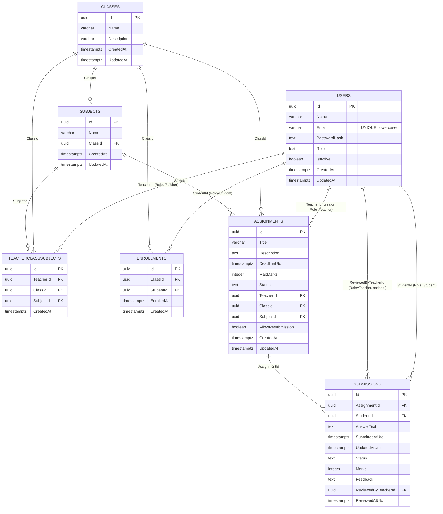

# Database Schema — Assignment & Submission Management System

> **Status:** Phase 0 design artifact.
> **Scope:** This document is the single, self-contained source of truth for the persistence layer. A developer must be able to build the EF Core model and generate the initial migration from this file **without** re-reading `PRD.md`.
> **Authoritative naming:** All entity, column, and enum names below are the canonical contract names and must not be renamed.

---

## 1. Overview

| Aspect | Decision |
|---|---|
| Database | **PostgreSQL 14+** |
| ORM / Provider | **EF Core 8** (`Microsoft.EntityFrameworkCore` 8.x) + **Npgsql** provider (`Npgsql.EntityFrameworkCore.PostgreSQL` 8.x) |
| Modeling approach | **Code-first**; entity classes own the schema; migrations are generated via `dotnet ef migrations add` |
| Primary keys | Surrogate `Guid` (UUID), server-side or client-side generated (`Guid.NewGuid()`) |
| Timestamps | All date/time columns are `DateTime` with `DateTimeKind.Utc`. Column names suffixed `Utc` (`DeadlineUtc`, `SubmittedAtUtc`, `ReviewedAtUtc`); generic audit columns are `CreatedAt` / `UpdatedAt` and also stored UTC |
| Password storage | `PasswordHash` is a **BCrypt** hash (`BCrypt.Net-Next`). It is **never** mapped to any DTO / serialized / logged |
| Soft delete | Users are **soft-disabled** via `IsActive = false`. Other entities support **hard delete** (also allowed on Users). There is no global query filter / `IsDeleted` column |
| Naming conventions | C# entities use **PascalCase**; default table names are derived from the PascalCase entity class name. A `UseSnakeCaseNamingConvention()` call (from `Npgsql.EntityFrameworkCore.PostgreSQL`) maps tables/columns to **snake_case** (e.g. `TeacherClassSubjects` → `teacher_class_subjects`, `DeadlineUtc` → `deadline_utc`). This is the recommended convention; if not applied, table-per-type / raw entity names are used |
| Enumerations | Stored as **strings** in PostgreSQL (value-converted), never as native Postgres enums or ints — see §2 |
| Auditing | `CreatedAt` set on insert; `UpdatedAt` updated on every successful write (application-managed, no DB trigger required) |

---

## 2. Enumerations

All enums are C# `enum` types (default underlying `int`) persisted to PostgreSQL as **`text`** via an EF Core **value converter** (`HasConversion<string>()`). This keeps schema diffs trivial, is human-readable in `psql`, and avoids native Postgres enum migration pain.

| Enum (C# type) | Values (string stored in DB) | Default value | Used by |
|---|---|---|---|
| `UserRole` | `Admin`, `Teacher`, `Student` | *(none — required)* | `Users.Role` |
| `AssignmentStatus` | `Draft`, `Published`, `Archived` | `Draft` | `Assignments.Status` |
| `SubmissionStatus` | `Submitted`, `UnderReview`, `Reviewed`, `LateSubmitted` | `Submitted` | `Submissions.Status` |

**PostgreSQL rendering** (example column definition the migration emits):

```sql
role      text NOT NULL,                 -- constrained by app value converter / CHECK
status    text NOT NULL DEFAULT 'Draft',
status    text NOT NULL DEFAULT 'Submitted',
```

> **Note:** A defensive `CHECK (role IN ('Admin','Teacher','Student'))` style constraint is optional; correctness is primarily enforced in the application/validation layer because the value converter restricts the domain to valid enum names.

---

## 3. Entities

Conventions shared by every table:

- **Primary key:** `Id : Guid` → PostgreSQL `uuid`, PK, clustered equivalent.
- **`CreatedAt` : DateTime (Utc)** → `timestamp with time zone` (`timestamptz`), NOT NULL, set on insert.
- **`UpdatedAt` : DateTime? (Utc)** → `timestamptz`, NULLABLE, refreshed on update.
- **Required string length** notation `string(n)` maps to PostgreSQL `character varying(n)` (`varchar(n)`); unsized `string` / `text` maps to `text`.

### 3.1 `Users`

| Name | C# Type | DB Type | Nullable | Default | Constraints / Notes |
|---|---|---|---|---|---|
| `Id` | `Guid` | `uuid` | NO | `gen_random_uuid()` / client | **PK** |
| `Name` | `string` | `varchar(200)` | NO | — | Required, max 200 |
| `Email` | `string` | `varchar(256)` | NO | — | Required; **UNIQUE**; stored **lowercased** (normalized on write) |
| `PasswordHash` | `string` | `text` | NO | — | BCrypt hash; **never serialized/logged** |
| `Role` | `UserRole` | `text` | NO | — | `Admin` \| `Teacher` \| `Student` (see §2) |
| `IsActive` | `bool` | `boolean` | NO | `true` | Soft-disable flag |
| `CreatedAt` | `DateTime` (Utc) | `timestamptz` | NO | `now()` | Audit |
| `UpdatedAt` | `DateTime?` (Utc) | `timestamptz` | YES | NULL | Audit |

- **Unique constraints / indexes:** `UX_Users_Email` UNIQUE on lowercased `Email`.
- **Query indexes:** `IX_Users_Email` (covers login lookup).
- **Referential role guidance:** FK columns elsewhere target `Users.Id`; the `Role` value of the referenced row is enforced in application logic (e.g. `TeacherId` must reference a `Role = 'Teacher'` user).

### 3.2 `Classes`

| Name | C# Type | DB Type | Nullable | Default | Constraints / Notes |
|---|---|---|---|---|---|
| `Id` | `Guid` | `uuid` | NO | client / DB | **PK** |
| `Name` | `string` | `varchar(150)` | NO | — | Required, max 150 |
| `Description` | `string?` | `varchar(1000)` | YES | NULL | Optional |
| `CreatedAt` | `DateTime` (Utc) | `timestamptz` | NO | `now()` | Audit |
| `UpdatedAt` | `DateTime?` (Utc) | `timestamptz` | YES | NULL | Audit |

- **FKs:** none (root aggregate).
- **Indexes:** `IX_Classes_Name` (optional, for listing/search).
- **Referenced by:** `Subjects.ClassId`, `TeacherClassSubjects.ClassId`, `Enrollments.ClassId`, `Assignments.ClassId`.

### 3.3 `Subjects`

| Name | C# Type | DB Type | Nullable | Default | Constraints / Notes |
|---|---|---|---|---|---|
| `Id` | `Guid` | `uuid` | NO | client / DB | **PK** |
| `Name` | `string` | `varchar(150)` | NO | — | Required, max 150 |
| `ClassId` | `Guid` | `uuid` | NO | — | **FK → Classes.Id** (required) |
| `CreatedAt` | `DateTime` (Utc) | `timestamptz` | NO | `now()` | Audit |
| `UpdatedAt` | `DateTime?` (Utc) | `timestamptz` | YES | NULL | Audit |

- **Unique constraints / indexes:** `UX_Subjects_ClassId_Name` UNIQUE on (`ClassId`, `Name`) — subject name unique within a class.
- **FKs:** `ClassId` → `Classes.Id`, **Cascade** delete (deleting a class removes its subjects).
- **Referenced by:** `TeacherClassSubjects.SubjectId`, `Assignments.SubjectId`.

### 3.4 `TeacherClassSubjects`

| Name | C# Type | DB Type | Nullable | Default | Constraints / Notes |
|---|---|---|---|---|---|
| `Id` | `Guid` | `uuid` | NO | client / DB | **PK** |
| `TeacherId` | `Guid` | `uuid` | NO | — | **FK → Users.Id** (required; referenced user `Role = 'Teacher'`) |
| `ClassId` | `Guid` | `uuid` | NO | — | **FK → Classes.Id** (required) |
| `SubjectId` | `Guid` | `uuid` | NO | — | **FK → Subjects.Id** (required) |
| `CreatedAt` | `DateTime` (Utc) | `timestamptz` | NO | `now()` | Audit |

- **Unique constraints / indexes:** `UX_TeacherClassSubjects_TeacherId_ClassId_SubjectId` UNIQUE on (`TeacherId`, `ClassId`, `SubjectId`) — no duplicate assignment.
- **FKs:** all three **Restrict** delete (do not silently unlink a teacher/class/subject; remove the row explicitly).
- **Purpose:** Join entity expressing "teacher T teaches subject S in class C". Used to authorize assignment creation.

### 3.5 `Enrollments`

| Name | C# Type | DB Type | Nullable | Default | Constraints / Notes |
|---|---|---|---|---|---|
| `Id` | `Guid` | `uuid` | NO | client / DB | **PK** |
| `ClassId` | `Guid` | `uuid` | NO | — | **FK → Classes.Id** (required) |
| `StudentId` | `Guid` | `uuid` | NO | — | **FK → Users.Id** (required; referenced user `Role = 'Student'`) |
| `EnrolledAt` | `DateTime` (Utc) | `timestamptz` | NO | `now()` | Enrollment timestamp |
| `CreatedAt` | `DateTime` (Utc) | `timestamptz` | NO | `now()` | Audit (kept alongside `EnrolledAt` for convention uniformity) |

- **Unique constraints / indexes:** `UX_Enrollments_ClassId_StudentId` UNIQUE on (`ClassId`, `StudentId`) — a student is enrolled in a class at most once (a student may belong to many classes).
- **FKs:** `ClassId` → `Classes.Id` **Cascade**; `StudentId` → `Users.Id` **Restrict**.
- **Purpose:** Authorizes which students can see `Published` assignments for a class.

### 3.6 `Assignments`

| Name | C# Type | DB Type | Nullable | Default | Constraints / Notes |
|---|---|---|---|---|---|
| `Id` | `Guid` | `uuid` | NO | client / DB | **PK** |
| `Title` | `string` | `varchar(200)` | NO | — | Required, max 200 |
| `Description` | `string` | `text` | NO | — | Required, unlimited length |
| `DeadlineUtc` | `DateTime` (Utc) | `timestamptz` | NO | — | Required; stored & compared UTC (`DateTimeKind.Utc`) |
| `MaxMarks` | `int` | `integer` | NO | — | Required; **CHECK `MaxMarks > 0`** |
| `Status` | `AssignmentStatus` | `text` | NO | `'Draft'` | `Draft` \| `Published` \| `Archived` (see §2) |
| `TeacherId` | `Guid` | `uuid` | NO | — | **FK → Users.Id** (required; creator teacher) |
| `ClassId` | `Guid` | `uuid` | NO | — | **FK → Classes.Id** (required) |
| `SubjectId` | `Guid` | `uuid` | NO | — | **FK → Subjects.Id** (required) |
| `AllowResubmission` | `bool` | `boolean` | NO | `true` | Whether students may update a submission before deadline |
| `CreatedAt` | `DateTime` (Utc) | `timestamptz` | NO | `now()` | Audit |
| `UpdatedAt` | `DateTime?` (Utc) | `timestamptz` | YES | NULL | Audit |

- **Unique constraints:** none.
- **Query indexes:**
  - `IX_Assignments_ClassId` — list assignments for a class.
  - `IX_Assignments_SubjectId` — filter by subject.
  - `IX_Assignments_TeacherId` — "my assignments" for a teacher.
  - `IX_Assignments_Status` — student visibility filter (`Published`).
  - Composite option: `IX_Assignments_ClassId_SubjectId_Status`.
- **FKs:** `TeacherId` → `Users.Id` **Restrict**; `ClassId` → `Classes.Id` **Cascade**; `SubjectId` → `Subjects.Id` **Cascade**.
- **CHECK constraints:** `MaxMarks > 0`.

### 3.7 `Submissions`

| Name | C# Type | DB Type | Nullable | Default | Constraints / Notes |
|---|---|---|---|---|---|
| `Id` | `Guid` | `uuid` | NO | client / DB | **PK** |
| `AssignmentId` | `Guid` | `uuid` | NO | — | **FK → Assignments.Id** (required) |
| `StudentId` | `Guid` | `uuid` | NO | — | **FK → Users.Id** (required; student) |
| `AnswerText` | `string` | `text` | NO | — | Required |
| `SubmittedAtUtc` | `DateTime` (Utc) | `timestamptz` | NO | `now()` | First submission time (UTC) |
| `UpdatedAtUtc` | `DateTime?` (Utc) | `timestamptz` | YES | NULL | Last edit time (UTC) |
| `Status` | `SubmissionStatus` | `text` | NO | `'Submitted'` | `Submitted` \| `UnderReview` \| `Reviewed` \| `LateSubmitted` (see §2) |
| `Marks` | `int?` | `integer` | YES | NULL | **CHECK `Marks >= 0`**; upper bound enforced against `Assignment.MaxMarks` in app (cross-row CHECK not used) |
| `Feedback` | `string?` | `text` | YES | NULL | Teacher feedback |
| `ReviewedByTeacherId` | `Guid?` | `uuid` | YES | NULL | **FK → Users.Id** (nullable; teacher who reviewed) |
| `ReviewedAtUtc` | `DateTime?` (Utc) | `timestamptz` | YES | NULL | Review timestamp (UTC) |

- **Unique constraints / indexes:** `UX_Submissions_AssignmentId_StudentId` UNIQUE on (`AssignmentId`, `StudentId`) — **one submission per (Assignment, Student)**.
- **Query indexes:**
  - `IX_Submissions_StudentId` — "my submissions" for a student.
  - `IX_Submissions_AssignmentId` — list submissions for an assignment.
  - `IX_Submissions_Status` — review queue filtering.
- **FKs:** `AssignmentId` → `Assignments.Id` **Cascade** (delete assignment removes its submissions); `StudentId` → `Users.Id` **Restrict**; `ReviewedByTeacherId` → `Users.Id` **Set Null** (keep the submission even if reviewer is later removed).
- **CHECK constraints:** `Marks IS NULL OR Marks >= 0`. The cross-row rule `Marks <= Assignment.MaxMarks` is enforced in application/validation logic (xUnit-covered) because PostgreSQL CHECK cannot reference another table.
- **Note on audit columns:** `Submissions` uses domain-specific `*Utc` audit names (`SubmittedAtUtc`, `UpdatedAtUtc`, `ReviewedAtUtc`) per contract, instead of the generic `CreatedAt`/`UpdatedAt`.

---

## 4. Relationships

The domain is centered on three reference axes:

1. **Academic structure:** `Classes` → `Subjects` (a class owns many subjects, name unique per class).
2. **Role bindings:** `TeacherClassSubjects` (teacher ↔ class ↔ subject, a 3-way join) and `Enrollments` (student ↔ class) express authorization relationships independently of assignments.
3. **Workflow:** `Users(Teacher)` → `Assignments` (1-to-many, by creator) → `Submissions` ← `Users(Student)`. A submission optionally references a second teacher via `ReviewedByTeacherId` for the review act.

`Users` is a polymorphic root shared by Admin/Teacher/Student; the distinguishing `Role` is application-enforced, not enforced by table split.

### Cardinality summary

| From | To | Cardinality | FK |
|---|---|---|---|
| `Subjects` | `Classes` | many → 1 | `Subjects.ClassId` |
| `TeacherClassSubjects` | `Users` (Teacher) | many → 1 | `.TeacherId` |
| `TeacherClassSubjects` | `Classes` | many → 1 | `.ClassId` |
| `TeacherClassSubjects` | `Subjects` | many → 1 | `.SubjectId` |
| `Enrollments` | `Classes` | many → 1 | `.ClassId` |
| `Enrollments` | `Users` (Student) | many → 1 | `.StudentId` |
| `Assignments` | `Users` (Teacher) | many → 1 | `.TeacherId` (creator) |
| `Assignments` | `Classes` | many → 1 | `.ClassId` |
| `Assignments` | `Subjects` | many → 1 | `.SubjectId` |
| `Submissions` | `Assignments` | many → 1 | `.AssignmentId` |
| `Submissions` | `Users` (Student) | many → 1 | `.StudentId` |
| `Submissions` | `Users` (Teacher) | many → 0..1 | `.ReviewedByTeacherId` |

### ER Diagram



---

## 5. Indexes

**Unique constraints (data integrity):**

| Name | Table | Columns | Purpose |
|---|---|---|---|
| `UX_Users_Email` | `Users` | `Email` (lowercased) | Unique login email |
| `UX_Subjects_ClassId_Name` | `Subjects` | (`ClassId`, `Name`) | Subject name unique per class |
| `UX_TeacherClassSubjects_TeacherId_ClassId_SubjectId` | `TeacherClassSubjects` | (`TeacherId`, `ClassId`, `SubjectId`) | No duplicate teacher↔class↔subject assignment |
| `UX_Enrollments_ClassId_StudentId` | `Enrollments` | (`ClassId`, `StudentId`) | Student enrolled in a class once |
| `UX_Submissions_AssignmentId_StudentId` | `Submissions` | (`AssignmentId`, `StudentId`) | One submission per (assignment, student) |

**Query indexes (performance):**

| Name | Table | Columns | Typical query |
|---|---|---|---|
| `IX_Users_Email` | `Users` | `Email` | Login lookup |
| `IX_Subjects_ClassId` | `Subjects` | `ClassId` | Subjects of a class |
| `IX_Assignments_ClassId` | `Assignments` | `ClassId` | Assignments by class |
| `IX_Assignments_SubjectId` | `Assignments` | `SubjectId` | Assignments by subject |
| `IX_Assignments_TeacherId` | `Assignments` | `TeacherId` | Teacher's own assignments |
| `IX_Assignments_Status` | `Assignments` | `Status` | Student visibility (`Published`) |
| `IX_Submissions_StudentId` | `Submissions` | `StudentId` | Student's submissions |
| `IX_Submissions_AssignmentId` | `Submissions` | `AssignmentId` | Submissions for an assignment |
| `IX_Submissions_Status` | `Submissions` | `Status` | Review queue |

> The primary-key indexes on each `Id` (unique btree) are created implicitly and not listed above.

---

## 6. EF Core Conventions

| Concern | Configuration |
|---|---|
| **Table naming** | `UseSnakeCaseNamingConvention()` applied in `OnModelCreating` / `UseNpgsql(...)` setup so PascalCase maps to snake_case (`Assignments` → `assignments`, `DeadlineUtc` → `deadline_utc`). Column types use Npgsql defaults. |
| **Enum → string** | Each enum property uses `.HasConversion<string>()` so values persist as `text` (human-readable; trivial to migrate). See §2. |
| **DateTime → UTC** | All `DateTime` columns are Npgsql `timestamp with time zone` (`timestamptz`). A value converter normalizes incoming values to `DateTimeKind.Utc` (e.g. `v => DateTime.SpecifyKind(v, DateTimeKind.Utc)`) so `DeadlineUtc` / `SubmittedAtUtc` / `ReviewedAtUtc` are always compared in UTC. |
| **Precision** | No `decimal`/`float` columns exist. `Marks` and `MaxMarks` are plain `int` (`integer`); no precision/scale configuration needed. |
| **Required vs optional** | Non-nullable C# reference types / value types map to NOT NULL; `?` (nullable) maps to nullable columns. `HasMaxLength(n)` enforces `varchar(n)` lengths (200, 256, 150, 1000) and `HasColumnType("text")` for free-form text (`Description`, `AnswerText`, `Feedback`, `PasswordHash`). |
| **Defaults** | `IsActive` default `true`; `Assignments.Status` default `AssignmentStatus.Draft`; `Assignments.AllowResubmission` default `true`; `Submissions.Status` default `SubmissionStatus.Submitted`. Configured via `.HasDefaultValue(...)`. |
| **CHECK constraints** | `Assignments.MaxMarks > 0` and `Submissions.Marks IS NULL OR Marks >= 0` added via raw SQL in the migration (`.HasCheckConstraint(...)` or `migrationBuilder.Sql(...)`). The cross-table rule `Marks <= Assignment.MaxMarks` is enforced in the application layer (see §8). |
| **Cascade rules** | `ClassId`/`SubjectId` → Cascade on class/subject delete; `TeacherId`/`StudentId` user references → Restrict; `ReviewedByTeacherId` → Set Null. See FK rows in §3. |
| **Owned types** | None. All entities are mapped as independent tables. |
| **Inheritance / TPH/TPT** | None. `UserRole` is a discriminator column-equivalent value, not a table-per-hierarchy mapping. |
| **Soft delete** | No `IsDeleted` column / no global query filter. Disable a user by setting `IsActive = false`. |
| **Timestamps** | `CreatedAt` set in the entity constructor or `SaveChanges` override; `UpdatedAt`/`UpdatedAtUtc` set in a `SaveChanges` override prior to persist. |
| **Sensitive data** | `PasswordHash` is mapped to the DB but excluded from every DTO via explicit projection / `[JsonIgnore]`-style handling at the API boundary. Never logged. |

---

## 7. Migration & Seed Plan

### 7.1 Migration structure

- A single **initial migration** (`<Timestamp>_InitialCreate`) is generated from the model snapshot:
  ```bash
  dotnet ef migrations add InitialCreate --project server/src/<Infrastructure> --startup-project server/src/<Api>
  dotnet ef database update
  ```
- The migration creates all 7 tables (`users`, `classes`, `subjects`, `teacher_class_subjects`, `enrollments`, `assignments`, `submissions`), their FKs, unique constraints, CHECK constraints, and query indexes in dependency order.
- **Idempotency:** `__EFMigrationsHistory` table tracks applied migrations; `dotnet ef database update` is idempotent and safe to re-run. Alternatively, `context.Database.MigrateAsync()` is invoked on application startup so first run auto-applies pending migrations — the evaluator needs **no manual table creation**.

### 7.2 Seeding

- A dedicated **seeder** (`DataSeeder` / `DbInitializer`) runs **on application startup** after `MigrateAsync`. It is **idempotent**: it checks for existing rows (e.g. by email / deterministic `Guid`s) and only inserts when absent, so restarts never duplicate data.
- Passwords are hashed with **BCrypt** at seed time; only the resulting `PasswordHash` is stored.
- Emails are stored **lowercased**.

### 7.3 Demo seed users (CONTRACT)

| Role | Email | Password (plaintext, hashed at seed) |
|---|---|---|
| `Admin` | `admin@example.com` | `admin@123` |
| `Teacher` | `teacher@example.com` | `teacher@123` |
| `Teacher` | `teacher2@example.com` | `teacher@123` |
| `Student` | `student@example.com` | `student@123` |

### 7.4 Sample rows (CONTRACT)

- **2 Classes** (e.g. "Class 9", "Class 10").
- **3 Subjects** distributed across the classes (e.g. Math, Physics, English) — respecting `UNIQUE(ClassId, Name)`.
- **TeacherClassSubjects** rows linking `teacher@example.com` (and optionally `teacher2@example.com`) to class+subject combinations.
- **Enrollments** rows linking `student@example.com` to at least the class that owns the Published assignment.
- **Assignments:** 1 **Draft** assignment + 1 **Published** assignment with a **future** `DeadlineUtc`, both authored by a seeded Teacher.
- **Submissions:** 1 **Reviewed** submission (status `Reviewed`, `Marks` populated ≤ `MaxMarks`, `Feedback` set, `ReviewedByTeacherId` and `ReviewedAtUtc` populated) made by `student@example.com` against the Published assignment.

> Deterministic `Guid`s may be used for seed entities to keep foreign keys stable across environments, but this is optional — the seeder only guarantees presence, not specific IDs.

---

## 8. Data Integrity Rules (restated)

These rules are the authoritative integrity invariants derived from the contract. They are enforced across DB CHECK constraints, EF model configuration, application validation, and unit tests.

1. **`Marks` is a non-negative integer** when present: `Marks IS NULL OR Marks >= 0` (DB CHECK + app validation).
2. **`Marks <= Assignment.MaxMarks`**: enforced in the application/validation layer on review (cross-table rule; not expressible as a single-row PostgreSQL CHECK). Covered by xUnit "marks validation" tests.
3. **`MaxMarks > 0`**: enforced via DB CHECK on `Assignments` and request validation.
4. **One submission per (Assignment, Student)**: enforced by `UX_Submissions_AssignmentId_StudentId`.
5. **Deadline stored & compared in UTC**: `Assignments.DeadlineUtc` and all `*Utc` submission columns use `DateTimeKind.Utc` + `timestamptz`; comparisons are always UTC (never local time).
6. **Email uniqueness & normalization**: `Users.Email` is unique and stored lowercased; lookups normalize input to lowercase.
7. **Subject uniqueness per class**: `UNIQUE(ClassId, Name)` on `Subjects`.
8. **Teacher assignment uniqueness**: `UNIQUE(TeacherId, ClassId, SubjectId)` on `TeacherClassSubjects`.
9. **Enrollment uniqueness**: `UNIQUE(ClassId, StudentId)` on `Enrollments`.
10. **Role-bound FKs (application-enforced):** `TeacherId` columns reference a user whose `Role = 'Teacher'`; `StudentId` columns reference `Role = 'Student'`. Enforced in command handlers / validation, not via a DB CHECK.
11. **User disable vs delete:** Users may be soft-disabled (`IsActive = false`, blocking login/visibility) **or** hard-deleted; FKs to users are `Restrict` (except `ReviewedByTeacherId` → `Set Null`) so deletion only succeeds when no dependent rows remain.
12. **Sensitive data:** `PasswordHash` is never selected into a response model, logged, or serialized.
