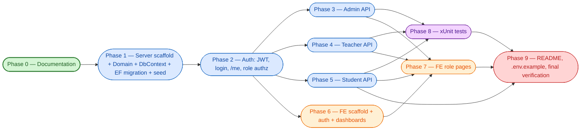

# Implementation Plan — Assignment & Submission Management System

> **Phase 0 process document.** This file sequences the build of the system into approval-gated phases.
> **Source of truth:** [`PRD.md`](./PRD.md) (authoritative, read-only). Companion Phase 0 docs:
> [`PROJECT_STRUCTURE.md`](./PROJECT_STRUCTURE.md), [`DATABASE_SCHEMA.md`](./DATABASE_SCHEMA.md),
> [`API_CONTRACT.md`](./API_CONTRACT.md), [`AUTH_MODEL.md`](./AUTH_MODEL.md),
> [`BUSINESS_RULES.md`](./BUSINESS_RULES.md). All names below use the **Canonical Contract** verbatim.

---

## 0. Canonical Contract (reference — in force for all phases)

| Item | Value |
|---|---|
| **PROJECT** | Assignment & Submission Management System. Repo: `client/`, `server/`, `docs/`, `plans/`. |
| **STACK** | Backend ASP.NET Core 8 + C#; EF Core 8 + Npgsql; PostgreSQL; BCrypt; JwtBearer HS256; FluentValidation; xUnit. Frontend Next.js 14 App Router + React + TypeScript + TailwindCSS. |
| **PHASES** | 0 Docs \| 1 Server scaffold+entities+DbContext+migrations+seed \| 2 Auth \| 3 Admin API \| 4 Teacher API \| 5 Student API \| 6 FE scaffold+auth+dashboards \| 7 FE role pages \| 8 xUnit tests \| 9 README/.env.example/final. |
| **DEPENDENCIES** | `1→{2,3,4,5}`; `2→{3,4,5}`; `{3,4,5}→8`; `2→6→7→9`; `{5,7,8}→9`. Run sequentially to avoid shared-file conflicts (`AppDbContext`, `Program.cs`, DTOs). |
| **PORTS** | API `5000`, client `3000`. |
| **DEMO USERS** | `admin@example.com` / `admin@123`; `teacher@example.com` / `teacher@123`; `teacher2@example.com` / `teacher@123`; `student@example.com` / `student@123`. |

---

## 1. Purpose

This document defines **phased delivery** for the Assignment & Submission Management System.

- **Docs are the source of truth.** `docs/` holds the authoritative design; `plans/` is scratch only.
- **Phase 0 (Documentation) is done first** — before any application code — so every later phase builds
  against an approved contract.
- **One phase at a time, approval-gated.** Each phase has explicit **dependencies** (which phases block it)
  and explicit **exit criteria** (a checklist that must pass before the phase is considered done).
- **After each phase:** update [`VERIFICATION_CHECKLIST.md`](./VERIFICATION_CHECKLIST.md) with the
  completed exit criteria and **commit** using the suggested Conventional Commit message (§4).
- **Verifiability over velocity:** the "Primary verify command" in §2 is the first signal that a phase is
  on track; the full exit-criteria checklist in §4 is the gate.

---

## 2. Phase Overview

| Phase | Name | Depends on | Scope (1 line) | Exit criteria (1 line) | Primary verify command |
|:---:|---|---|---|---|---|
| **0** | Documentation *(DONE in this orchestration)* | none | Authoritative design + process docs in `docs/`. | 10 docs exist & approved. | `ls docs/*.md \| wc -l` ≥ 10 |
| **1** | Server scaffold + Domain + DbContext + EF Initial migration + seed | 0 | .NET 8 solution, entities/enums, `AppDbContext`, `InitialCreate` migration, idempotent seed. | Solution builds; DB created with no manual SQL; seeded demo users. | `dotnet build server/AssignmentManagement.sln` |
| **2** | Auth: JWT, hashing, login, /me, role authz | 1 | JWT (HS256) login + `/me`, BCrypt hashing, role-based authorization. | Demo login returns JWT w/ role claim; role matrix enforced. | `dotnet build` + login probe against `:5000` |
| **3** | Admin API | 2 | User/class/subject/teacher-assignment/enrollment + read-all endpoints. | Admin CRUD + uniqueness/conflict codes correct; read-all works. | `dotnet build` |
| **4** | Teacher API | 2 | Assignment lifecycle + submission review. | Create/publish/ownership + review (marks range) enforced. | `dotnet build` |
| **5** | Student API | 2 | Assignment listing, submit/update, own-submission views. | Published+enrolled visibility; deadline + one-per-pair enforced. | `dotnet build` |
| **6** | Frontend scaffold + auth + role dashboards | 2 *(API contract stable)* | Next.js 14 scaffold, login, role dashboards, route guards. | Client builds; login→role redirect; protected routes guarded. | `npm run build` (in `client/`) |
| **7** | Frontend role pages | 6 and 3/4/5 *(for data)* | Admin/Teacher/Student pages wired to backend. | All role flows work end-to-end; states handled; build passes. | `npm run build` (in `client/`) |
| **8** | xUnit tests (rules + authz) | 2, 3, 4, 5 | Consolidated business-rule + authorization coverage. | `dotnet test` green across the TS-* scenario catalog. | `dotnet test` (in `server/`) |
| **9** | README, .env.example, final verification & polish | 7, 8 *(everything else done)* | README, env template, final checklist, polish. | Setup reproducible; no secrets; PRD §15 satisfied. | `dotnet test` && `npm run build` |

> **Dependency note (canonical):** although the contract lists `1→{2,3,4,5}` transitively, the
> approval-gated chain is `0→1→2`, after which `3/4/5` each depend directly on `2`. Phase 6 may start
> after `2` (API contract stable); it can run after `5` for full integration but the scaffold does not
> require `3/4/5` to be implemented.

---

## 3. Dependency Graph

**Edges, stated explicitly:**

- `0 → 1 → 2 → {3, 4, 5}` — the sequential backend spine.
- `{3, 4, 5} → 8` — the test phase consolidates rules from every API phase.
- `2 → 6 → 7 → 9` — the frontend chain (scaffold needs only a stable auth contract; pages need data).
- `{5, 7, 8} → 9` — finalization needs the full backend, frontend, and tests.
- `3 → 7`, `4 → 7`, `5 → 7` — Phase 7 pages consume Admin/Teacher/Student data.

**Which phases MAY run in parallel in principle:**

- **`3, 4, 5` after `2`** — they are independent API areas and could be developed concurrently.
- **`6`** can start as soon as `2` finishes (login contract is stable), in parallel with `3/4/5`.

> **In this orchestration, however, all phases run sequentially** to keep changes minimal and avoid
> shared-file conflicts (see §5).

---

## 4. Per-Phase Detail

### Phase 0 — Documentation

- **Objective:** Author the complete, self-contained Phase 0 documentation set that every subsequent
  phase implements against. Phase 0 is **DONE in this orchestration**.
- **Key deliverables:**
  - Authoritative requirements: `PRD.md` (read-only source of truth).
  - Design docs: `PROJECT_STRUCTURE.md`, `DATABASE_SCHEMA.md`, `API_CONTRACT.md`, `AUTH_MODEL.md`,
    `BUSINESS_RULES.md`.
  - Process docs: `IMPLEMENTATION_PLAN.md` (this file), `VERIFICATION_CHECKLIST.md`,
    `TASK_BREAKDOWN.md`.
  - All 10 Phase 0 artifacts present and internally consistent (names, enums, entities, endpoints,
    ports, demo users match the Canonical Contract).
- **Files/areas touched:** `docs/*` only. No code, no other directories.
- **Exit criteria:**
  - [ ] 10 Phase 0 docs exist in `docs/` and are approved.
  - [ ] Canonical Contract (stack, enums, entities, endpoints, ports, demo users) is consistent across
    all docs.
  - [ ] Each later phase is traceable to a doc (this plan's §4 ↔ `API_CONTRACT.md`/`AUTH_MODEL.md`/
    `DATABASE_SCHEMA.md`/`BUSINESS_RULES.md`).
- **Risks/notes:** None blocking. Keep `PRD.md` immutable; reflect clarifications as explicit
  assumptions in `README.md` (Phase 9), not in the PRD.
- **Suggested commit:** `docs: add Phase 0 specification and process documents`

---

### Phase 1 — Server scaffold + Domain + DbContext + EF Initial migration + seed

- **Objective:** Stand up the .NET 8 layered solution, implement the pure domain model, configure EF Core
  (Npgsql) with the `InitialCreate` migration, and seed idempotent demo/sample data so the evaluator can
  create the database with no manual SQL.
- **Key deliverables:**
  - Solution + 4 projects (`Api`, `Application`, `Domain`, `Infrastructure`) + `tests/UnitTests` skeleton;
    `Directory.Build.props`, `Directory.Packages.props` (central package management).
  - Domain: entities (`User`, `Class`, `Subject`, `TeacherClassSubject`, `Enrollment`, `Assignment`,
    `Submission`); enums (`UserRole`, `AssignmentStatus`, `SubmissionStatus`); exceptions; `DomainRules`.
  - `AppDbContext` + `IAppDbContext` + `IEntityTypeConfiguration<T>` per entity (snake_case naming,
    enum→string conversion, UTC timestamps, unique indexes, `MaxMarks > 0` and `Marks >= 0` CHECKs).
  - EF `InitialCreate` migration (committed).
  - Idempotent `DbSeeder`: demo users (BCrypt-hashed) + sample classes/subjects/teacher-assignments/
    enrollments + 1 `Draft` + 1 `Published` assignment (future deadline) + 1 `Reviewed` submission.
  - `Program.cs` DI wiring, `MigrateAsync` + seed on startup; `appsettings.json` / `Development.json` /
    `appsettings.example.json`; Swagger skeleton; repo-root `.gitignore`.
- **Files/areas touched:** `server/**`, repo-root `.gitignore`, root layout per `PROJECT_STRUCTURE.md`.
- **Exit criteria:**
  - [ ] `dotnet build server/AssignmentManagement.sln` succeeds with zero errors.
  - [ ] `dotnet ef database update` creates all 7 tables, FKs, unique indexes, and CHECKs (no manual SQL).
  - [ ] App starts on port `5000`; Swagger UI reachable at `/swagger`.
  - [ ] Demo users present with BCrypt hashes (never plaintext); re-running the app does not duplicate seed.
  - [ ] At least 1 `Draft` + 1 `Published` assignment and 1 `Reviewed` submission are seeded.
  - [ ] UTC columns and enum→string storage verified in the schema.
- **Risks/notes:** PostgreSQL must be running (see §6). The `InitialCreate` migration **must be
  committed** (do not git-ignore `Migrations/`).
- **Suggested commit:** `feat(server): scaffold solution, domain model, EF migrations and seed`

---

### Phase 2 — Auth: JWT, hashing, login, /me, role authz

- **Objective:** Implement JWT (HS256) authentication per `AUTH_MODEL.md` — login, `/me`, BCrypt hashing,
  and backend role-based authorization — so the role matrix is enforceable before any feature API ships.
- **Key deliverables:**
  - `IPasswordHasher` / `PasswordHasher` (BCrypt, work factor 11).
  - `JwtTokenService` issuing claims `sub`/`email`/`role`/`name`/`jti`/`iat`/`exp`; HS256;
    `exp = iat + 120`.
  - JwtBearer config: all four validations enabled (`Issuer`, `Audience`, `Lifetime`, `IssuerSigningKey`),
    `ClockSkew ≈ 0`.
  - `AuthService` + `AuthController`: `POST /api/auth/login` (public), `GET /api/auth/me` (`[Authorize]`).
  - DTOs: `LoginRequest`, `AuthResponse` (`token`, `expiresAt`, `user`), `UserDto` (no `PasswordHash`).
  - `ICurrentUserService`; role policies (`AdminOnly`, `TeacherOnly`, `StudentOnly`).
  - `LoginRequestValidator` (FluentValidation); global `ExceptionMiddleware` → error envelope.
- **Files/areas touched:** `Infrastructure/Identity/`, `Application/{Services,DTOs/Auth,Common}/`,
  `Api/{Controllers/AuthController,Extensions/{Jwt,Swagger}Extensions,Middleware}/`, `Program.cs`.
- **Exit criteria:**
  - [ ] Valid demo login → `200` with a JWT whose `role` claim matches `UserRole`; invalid → `401`
    generic `"Invalid email or password."`.
  - [ ] `GET /api/auth/me` returns current user (no `PasswordHash`) with a valid token; `401` without.
  - [ ] `[Authorize(Roles=...)]` / policies enforced: cross-role → `403`; missing/invalid token → `401`.
  - [ ] JWT validations (iss/aud/lifetime/signing) enabled.
  - [ ] Failed login logged (email + IP only; never password or hash).
- **Risks/notes:** `Jwt__Secret` must be ≥ 32 bytes (HS256) — validate at startup (see §6).
- **Suggested commit:** `feat(auth): JWT login, /me, BCrypt hashing and role authorization`

---

### Phase 3 — Admin API

- **Objective:** Ship all Admin-only endpoints per `API_CONTRACT.md` §4 (user/class/subject/
  teacher-assignment/enrollment management + read-all assignments/submissions).
- **Key deliverables:**
  - Controllers: `AdminUsersController`, `AdminClassesController`, `AdminSubjectsController`,
    `AdminTeacherAssignmentsController`, `EnrollmentsController`, `AdminAssignmentsController` (GET all),
    `AdminSubmissionsController` (GET all).
  - Services: `UserService`, `ClassService`, `SubjectService`, `TeacherAssignmentService`,
    `EnrollmentService`, plus read-all for assignments/submissions.
  - DTOs (`Users`, `Classes`, `Subjects`, `TeacherAssignments`, `Enrollments`) and validators
    (`CreateUserRequestValidator`, …).
  - DI registration + controller routing in `Program.cs`.
- **Files/areas touched:** `Api/Controllers/Admin*`, `Application/{Services,DTOs/*,Validators}`,
  `Program.cs` (shared — see §5).
- **Exit criteria:**
  - [ ] All Admin CRUD + teacher-assignment + enrollment endpoints return correct success/error codes
    (`201/200/204/400/404/409`).
  - [ ] `409` on duplicate email, `(classId,name)`, `(teacherId,classId,subjectId)`, `(classId,studentId)`.
  - [ ] `404` on missing FK references or wrong-role references (e.g. assigning a non-Teacher).
  - [ ] Admin read-all returns **all** assignments/submissions regardless of owner/status (ADM-001/002/003).
  - [ ] Non-Admin → `403`; missing token → `401`.
- **Risks/notes:** Email is stored lowercased and compared case-insensitively. Shares `Program.cs` /
  `AppDbContext` DI with Phases 4/5 (run sequentially — §5).
- **Suggested commit:** `feat(admin): user, class, subject, teacher-assignment and enrollment APIs`

---

### Phase 4 — Teacher API

- **Objective:** Ship the Teacher assignment lifecycle and submission review endpoints per
  `API_CONTRACT.md` §5, enforcing ownership and the review rules.
- **Key deliverables:**
  - Controllers: `TeacherAssignmentsController` (CRUD + `POST …/{id}/publish`),
    `TeacherSubmissionsController` (`GET …/submissions`, `PUT …/submissions/{id}/review`).
  - Services: `AssignmentService` (create only for assigned `(classId,subjectId)`, ownership,
    default `Draft`, publish `Draft → Published`); `SubmissionService` review (marks ∈ `[0, MaxMarks]`,
    optional feedback, status default `Reviewed`, stamp `ReviewedByTeacherId` / `ReviewedAtUtc`).
  - DTOs (`Assignments`, `Submissions`/`Review`) and validators (`CreateAssignmentRequestValidator`,
    `ReviewSubmissionRequestValidator`).
- **Files/areas touched:** `Api/Controllers/Teacher*`, `Application/{Services,DTOs/{Assignments,Submissions},Validators}`,
  `Program.cs` (shared).
- **Exit criteria:**
  - [ ] Create allowed only where a `TeacherClassSubjects(TeacherId, ClassId, SubjectId)` row exists; else `403`.
  - [ ] New assignments start as `Draft`; `publish` transitions `Draft → Published`.
  - [ ] Ownership enforced on get/put/delete/publish and on review (`403` for non-owner; `404` for missing).
  - [ ] Review rejects `marks < 0` and `marks > MaxMarks` (`400`); feedback optional; status defaults `Reviewed`.
  - [ ] Non-Teacher → `403`.
- **Risks/notes:** `MaxMarks > 0` enforced on create; deadline must be a valid future UTC date.
- **Suggested commit:** `feat(teacher): assignment lifecycle and submission review APIs`

---

### Phase 5 — Student API

- **Objective:** Ship the Student endpoints per `API_CONTRACT.md` §6 — assignment listing/detail, submit,
  update, and own-submission views — enforcing visibility, deadline, and uniqueness rules.
- **Key deliverables:**
  - Controllers: `StudentAssignmentsController` (list, detail, `submit`),
    `StudentSubmissionsController` (list, detail, update).
  - `SubmissionService` extensions: visible only where `Published` **and** enrolled; submit only before
    deadline (UTC); resubmit upsert when `AllowResubmission == true`, else `409`; update before deadline
    and only when `AllowResubmission`; owner filter on reads.
  - DTOs (`SubmitRequest`, `UpdateSubmissionRequest`) and validators.
- **Files/areas touched:** `Api/Controllers/Student*`, `Application/{Services,DTOs/Submissions,Validators}`,
  `Program.cs` (shared).
- **Exit criteria:**
  - [ ] Students see only `Published` assignments for enrolled classes; drafts → `404` (invisible).
  - [ ] Submit blocked after deadline (`400`); not-enrolled → `403`/`404`.
  - [ ] One submission per `(assignment, student)`: resubmit upserts if `AllowResubmission`, else `409`.
  - [ ] Update blocked after deadline and when `AllowResubmission == false`.
  - [ ] Students view only their own submissions (`403`/`404` for others' — SUB-007/BR-8).
  - [ ] Non-Student → `403`.
- **Risks/notes:** Late-submission semantics are "no submit/update after deadline" (BR-6/7);
  `LateSubmitted` status reserved for future extension.
- **Suggested commit:** `feat(student): assignment listing, submission and review-view APIs`

---

### Phase 6 — Frontend scaffold + auth + role dashboards

- **Objective:** Scaffold the Next.js 14 App Router client, implement JWT login + token handling, role
  dashboards, and route protection (edge middleware + client `RoleGuard`). The API contract from Phase 2
  is sufficient; `3/4/5` are not strictly required for the scaffold.
- **Key deliverables:**
  - `package.json` deps (`next@14`, `react`, `typescript`, `tailwindcss`, `axios`/`zod`, …), `tsconfig`,
    `tailwind`/`postcss`, `next.config.mjs`, `.env.example`.
  - `app/` root layout + role-redirect entry; `(auth)/login` page + `LoginForm`.
  - `lib/api/{client,endpoints}`, `lib/auth/{token,session}`, `lib/{types,constants,utils}` (UTC formatting),
    `hooks/{useAuth,useCurrentUser,useApi}`.
  - `components/layout/{RoleShell,Sidebar,Topbar}`, `components/ui/*` primitives, `components/guards/RoleGuard`.
  - `middleware.ts` (route protection + role-based redirect; backend remains the authority).
- **Files/areas touched:** `client/**` (new).
- **Exit criteria:**
  - [ ] `npm install` + `npm run dev` runs the client on port `3000`.
  - [ ] Login posts to API (`:5000`), stores the JWT, and redirects by role.
  - [ ] Protected routes redirect unauthenticated users to `/login`; cross-role URLs are blocked.
  - [ ] Role dashboards render for Admin/Teacher/Student with loading/empty/error states.
  - [ ] UTC deadlines rendered with a timezone note (see §6).
- **Risks/notes:** Client guards are defense-in-depth; the backend is the single authority for authz.
- **Suggested commit:** `feat(client): scaffold, auth, role-based dashboards and route guards`

---

### Phase 7 — Frontend role pages

- **Objective:** Implement Admin/Teacher/Student pages wired to the backend (Phases 3/4/5 for data),
  including validated forms and consistent states.
- **Key deliverables:**
  - Admin pages: `users`, `classes`, `subjects`, `teacher-assignments`, `enrollments`, `assignments`,
    `submissions`.
  - Teacher pages: assignments `list`/`new`/`[id]/edit`, `[id]/submissions`, `submissions/[id]` review.
  - Student pages: assignments `list`/`[id]` (view + submit), submissions `list`/`[id]`.
  - Form components (`AssignmentForm`, `SubmissionForm`) with validation; status `Badge` + state components.
- **Files/areas touched:** `client/src/app/{admin,teacher,student}/**`, `components/forms/*`.
- **Exit criteria:**
  - [ ] All pages consume the correct API areas; CRUD works end-to-end per role.
  - [ ] Forms show validation + API errors; loading/empty/error states are present.
  - [ ] Role-restricted actions are hidden/disabled in the UI (defense in depth).
  - [ ] `npm run build` succeeds.
- **Risks/notes:** Surface only the fields a role may mutate; never trust the client for authz.
- **Suggested commit:** `feat(client): admin, teacher and student pages`

---

### Phase 8 — xUnit tests (rules + authz)

- **Objective:** Consolidate and verify xUnit coverage for business rules and authorization against the
  `BUSINESS_RULES.md` §10 scenario catalog and PRD §13. Tests may be authored incrementally in Phases 2–5
  but are **consolidated and verified** here.
- **Key deliverables:**
  - `AssignmentManagement.UnitTests` project + test fixture (EF In-Memory or Testcontainers PostgreSQL).
  - `Services/` tests (`UserService`, `AssignmentService`, `SubmissionService`).
  - `Auth/AuthServiceTests` (valid login → JWT; invalid → 401) and `AuthorizationTests` (role matrix).
  - `Rules/` tests (`AssignmentRulesTests`, `SubmissionRulesTests`, `ReviewRulesTests`) mapping to
    `TS-AUTH/USER/CLASS/ASGN/SUB/REV/ADM/CROSS` scenarios.
- **Files/areas touched:** `server/tests/AssignmentManagement.UnitTests/**`.
- **Exit criteria:**
  - [ ] `dotnet test` is green across the scenario catalog.
  - [ ] Auth: valid login → JWT with `role`; invalid → 401; admin ok, teacher blocked from admin,
    student blocked from teacher (TS-AUTH-01..05).
  - [ ] Rules: unassigned create → 403; draft hidden; published visible to enrolled; `MaxMarks > 0`;
    submit/update deadline semantics; one-per-pair; cross-student hidden; review ownership; marks range
    (TS-ASGN/SUB/REV-*).
  - [ ] `PasswordHash` never appears in any response (TS-CROSS-02).
- **Risks/notes:** In-Memory provider does not enforce CHECK/unique constraints the same way Postgres
  does — prefer Testcontainers for constraint-sensitive tests, or assert at the service layer.
- **Suggested commit:** `test: xUnit coverage for business rules and authorization`

---

### Phase 9 — README, .env.example, final verification & polish

- **Objective:** Deliver README, the env template, and a final verification pass so the project is
  reproducible and submission-ready (PRD §14–§15).
- **Key deliverables:**
  - `README.md` (overview, features, stack, structure, backend/frontend/db/test setup, demo credentials,
    assumptions, known limitations) per PRD §14.4.
  - Root `.env.example` (backend + frontend vars, per the Canonical Contract).
  - Final verification pass against PRD §15; update `VERIFICATION_CHECKLIST.md`; confirm no secrets committed.
- **Files/areas touched:** `README.md`, `.env.example`, `VERIFICATION_CHECKLIST.md`.
- **Exit criteria:**
  - [ ] README complete per PRD §14.4.
  - [ ] `.env.example` present (backend + frontend vars) with **no** real secrets.
  - [ ] Local setup reproducible: Postgres up → `dotnet ef database update` → seed → run API → run client.
  - [ ] `dotnet test` green **and** `npm run build` succeeds.
  - [ ] PRD §15 final checklist satisfied; no secrets in the repo.
- **Risks/notes:** Ensure demo credentials are clearly marked as demo-only (PRD §14.5).
- **Suggested commit:** `docs: README, env example and final verification`

---

## 5. Parallelization Note

In principle, **backend phases 3, 4, and 5 are independent** once Phase 2 is done, and **Phase 6** can
start in parallel with them (it only needs the stable auth contract from Phase 2). However:

- **3 / 4 / 5 all touch shared files** — every backend API phase edits `AppDbContext` registrations, the
  `Program.cs` DI/pipeline block, common DTOs and mappers, `ExceptionMiddleware`, and the shared
  authorization policies. Running them concurrently would cause frequent merge conflicts on these hot
  files.
- **6 / 7 are sequential** — Phase 7 pages build directly on the Phase 6 scaffold, shared layout, API
  client, and route guards.

**Therefore, in this orchestration all phases run strictly sequentially** (0 → 1 → 2 → 3 → 4 → 5 →
6 → 7 → 8 → 9). This minimizes cross-file conflicts and keeps each phase's changeset small and
reviewable. If a future team parallelizes, Phases 3/4/5 should be split into separate worktrees with an
explicit merge order, and the shared `Program.cs`/`AppDbContext` changes coordinated first.

---

## 6. Risks & Mitigations

| Risk | Impact | Mitigation |
|---|---|---|
| **PostgreSQL not running** when `dotnet ef database update` / startup seed runs. | Phase 1 cannot create the DB; app fails to start. | Document local Postgres or `docker-compose` + the `ConnectionStrings__DefaultConnection` value; call `MigrateAsync()` on startup so first run auto-applies pending migrations (DATABASE_SCHEMA §7.1). |
| **JWT secret too short.** HS256 requires ≥ 256-bit key. | App crashes or tokens are insecure. | Validate `Jwt__Secret` length (≥ 32 bytes) at startup; ship a long placeholder in `.env.example`; see `AUTH_MODEL.md` §2/§10. |
| **Timezone display on the client.** Deadlines are UTC; users expect local times. | Students misread deadlines; wrong before/after verdict. | Store and compare **UTC only** (`DateTime.UtcNow`, `DateTimeKind.Utc`, BR-12); format on the client with an explicit "UTC" note; never use `DateTime.Now` server-side (TS-CROSS-01). |
| **Late-submission semantics ambiguity.** | Inconsistent submit/update behavior. | Rule: **no submit or update after `DeadlineUtc`** (BR-6/7). `AllowResubmission` (default `true`) only permits *pre-deadline* updates; `LateSubmitted` status is reserved for future extension. Document as an assumption in README. |
| **Parallel shared-file conflicts** in backend phases 3/4/5. | Broken builds, merge churn. | Run sequentially (§5); coordinate `Program.cs`/`AppDbContext`/common DTOs first if parallelized. |
| **Soft vs hard delete of users.** | Orphaned FKs or unexpected data loss. | Disable via `IsActive = false`; FKs to users are `Restrict` (except `ReviewedByTeacherId → Set Null`); document choice in README (DATABASE_SCHEMA §3.1/§8). |
| **`PasswordHash` leakage.** | Security violation (BR-13). | Never map `PasswordHash` into any DTO/log; assert via TS-CROSS-02. |
| **Non-idempotent seeding.** | Duplicate demo data on restart. | Seeder checks-before-insert (by email / deterministic `Guid`s); verified in Phase 1 exit criteria. |
| **Migrations accidentally git-ignored.** | Evaluator cannot recreate the DB. | Commit `Migrations/`; root `.gitignore` must **not** exclude it. |
| **In-Memory test provider ≠ Postgres constraints.** | Tests pass but DB rejects (or vice versa). | Use Testcontainers PostgreSQL for constraint-sensitive tests; assert uniqueness/CHECK behavior at the service layer too (Phase 8). |

---

## 7. Definition of Done (PRD §18 mapped to phases)

The project is complete when **all** of the following are satisfied (PRD §18). Each item is mapped to the
phase that delivers it and how it is verified.

| # | Definition of Done (PRD §18) | Delivered in | Verified by |
|:---:|---|:---:|---|
| 1 | Admin, Teacher, and Student roles can log in. | **2** | `POST /api/auth/login` returns a JWT with the correct `role` claim (TS-AUTH-01). |
| 2 | Role-based access is enforced by the backend. | **2** | Role matrix: cross-role → `403`, missing token → `401` (TS-AUTH-03/04/05, BR-11). |
| 3 | Admin can manage users, classes, subjects, teacher assignments, and enrollments. | **3** | Admin CRUD + uniqueness/conflict codes; read-all endpoints (TS-USER/CLASS-*). |
| 4 | Teacher can create, publish, update, and delete assignments. | **4** | Ownership-enforced CRUD + publish `Draft → Published` (TS-ASGN-01/05/06/09). |
| 5 | Student can view published assignments and submit answers. | **5** | Published+enrolled visibility; submit before deadline (TS-ASGN-03, TS-SUB-01). |
| 6 | Student can update a submission before the deadline, if allowed. | **5** | Pre-deadline + `AllowResubmission` gate (TS-SUB-03/10). |
| 7 | Teacher can review submissions and assign marks/feedback. | **4** | Review ownership + `0 ≤ marks ≤ MaxMarks` (TS-REV-01/02/03). |
| 8 | Database can be created locally without manual table creation. | **1** | `dotnet ef database update` builds all 7 tables, FKs, indexes, CHECKs. |
| 9 | Seed data provides working demo users. | **1** | Demo users present with BCrypt hashes; idempotent on restart. |
| 10 | Unit tests cover important business rules. | **8** | `dotnet test` green across the `TS-*` scenario catalog. |
| 11 | README contains full setup instructions. | **9** | README satisfies PRD §14.4. |
| 12 | No real secrets are committed. | **9** *(ongoing)* | `.env.example` only; no real passwords/keys/JWT secrets in git history. |

> **Completion gate:** Phase 9 is reached only after Phases 7 and 8 are done (§3), at which point every
> Definition-of-Done item above is deliverable and verifiable.

---

*End of Implementation Plan. Authoritative requirements: [`PRD.md`](./PRD.md). Verification log:
[`VERIFICATION_CHECKLIST.md`](./VERIFICATION_CHECKLIST.md).*
